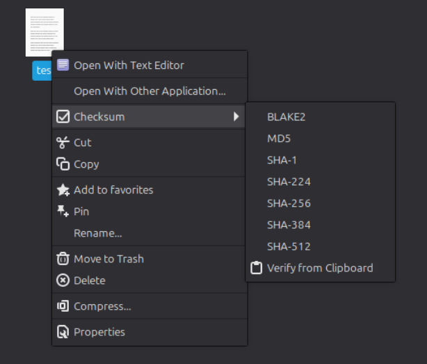
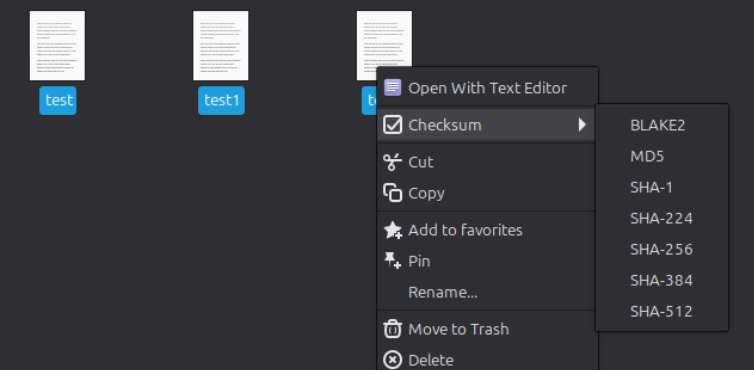
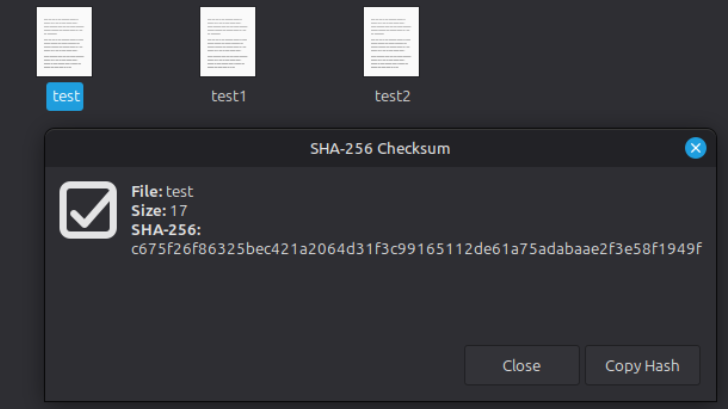
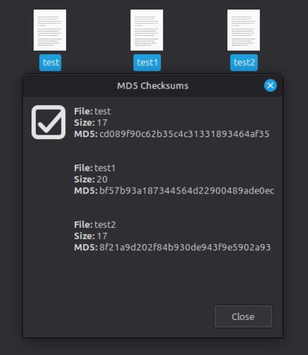
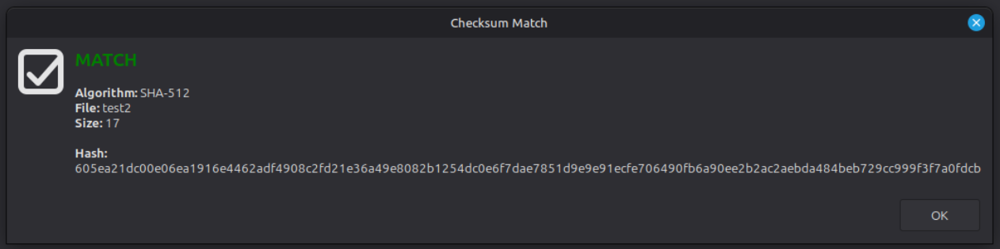
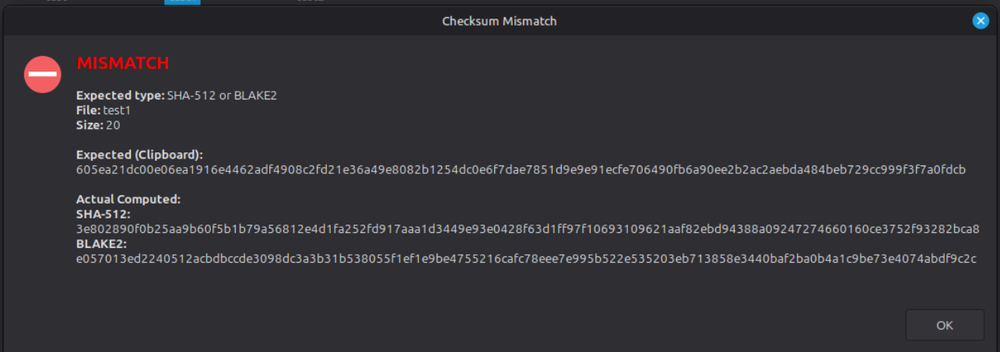

# Nemo Checksum Menu

A collection of Nemo actions that adds a 7-Zip style Checksum submenu to your right-click context menu.

## What does it do?

### 1. Calculate checksums with a right-click

Select one or more files, right-click, and instantly calculate their hashes. The results are displayed in a clean, native GUI popup. If you calculate a hash for a single file, you get a convenient **Copy Hash** button to instantly send the result to your clipboard.

Supported algorithms natively provided by the gnu `coreutils` package (zero extra heavy dependencies):

* `b2sum` (BLAKE2)
* `md5sum`
* `sha1sum`
* `sha224sum`
* `sha256sum`
* `sha384sum`
* `sha512sum`

### 2. Verify checksums from your clipboard instantly

Copied a hash from a download page? Just right-click the downloaded file and select **Verify from Clipboard**.

* The script automatically reads your clipboard and determines the algorithm based on the character length.
* In cases of ambiguity (e.g., both SHA-512 and BLAKE2 produce 128-character hashes), it smartly calculates and tests against all matching algorithms.
* Outputs a clear green **MATCH** or red **MISMATCH** popup.

## Why does it exist?

I missed the quick, frictionless checksum utility that 7-Zip provides on Windows.

Currently, Linux Mint has a utility for verifying `.iso` files, but it is strictly limited to SHA-256 and signed GPG files. While there are public Cinnamon Spices that do parts of this, they are typically limited to a single algorithm and a single function (either calculate *or* verify).

This project combines all algorithms and automatic clipboard verification into a single, organized submenu using native system tools.

## Installation & Removal

### To Install

Clone this repository and run the installer script:

```bash
git clone https://github.com/Pwlcz/nemo_checksums.git
cd nemo_checksums
./installer.sh
```

#### Dependencies

The core hashing algorithms (`md5sum`, `sha256sum`, etc.) are already built into your system via `coreutils`.

However, the graphical popups, clipboard integration, and installer script require a few standard packages:

* `zenity` (Handles the native GUI dialog windows - usually pre-installed on Linux Mint/Cinnamon)
* `xclip` (Reads and writes clipboard data)
* `jq` (Used by the installer script to safely inject the submenu into Nemo's JSON layout)

If you are missing any of them (`./installer.sh` checks if these programs are present), you can install them via terminal:

```bash
sudo apt install zenity xclip jq
```

### To Remove

1. **Remove from Context Menu**: Open Nemo `Edit -> Preferences -> Plugins -> Edit layout` (or go to `System Settings -> Actions`), navigate to the Layout tab, and delete the Checksum submenu.

2. **Delete the Files**: Because these actions are installed locally (not via the Spices store), the files must be deleted manually from your Nemo actions directory:

```bash
rm -r ~/.local/share/nemo/actions/checksum-menu@pwlcz/
```

## How to use

**To Calculate**:

1. Select one or more files.

2. Right-click -> **Checksum** -> Select your preferred algorithm.



*Checksum submenu when 1 file is selected*



*Checksum submenu when multiple files are selected*

1. A window will pop up with the results. If a single file was selected, click **Copy Hash** to save it to your clipboard.



*Dialog window when 1 file is selected*



*Dialog window when multiple files are selected*

**To Verify**:

1. Copy a valid hash (MD5, SHA-1, SHA-256, etc.) to your clipboard from any website.

2. Right-click the single file you want to check.

3. Select Checksum -> Verify from Clipboard.



*A successful match highlights the algorithm used and the matching string.*



*A failed match shows both calculated checksums and clipboard string*
